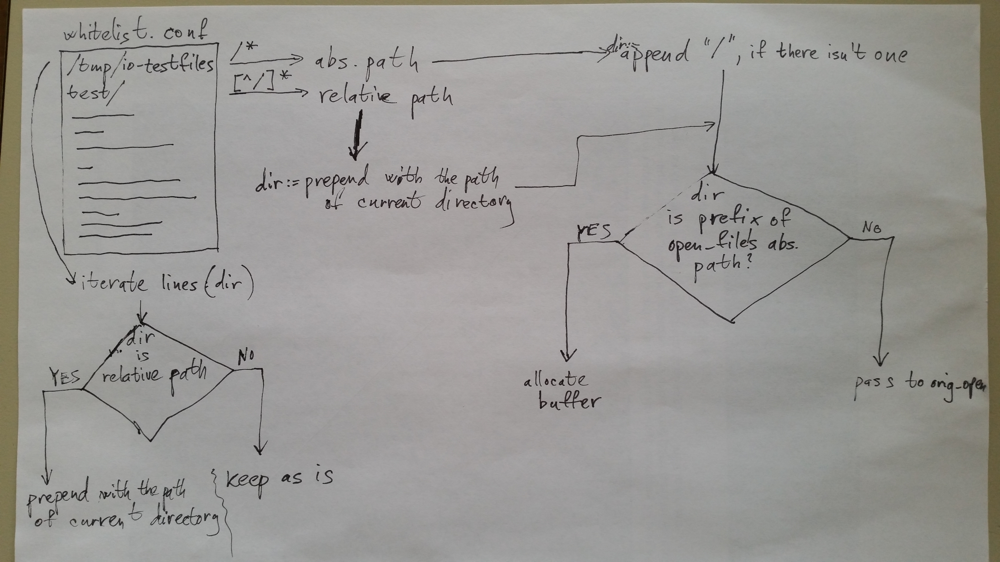

============
BUFREAD-LHCB
============

:Author: Karel Ha
:Contact: karel.ha@cern.ch, mathemage@gmail.com
:Created on: $Date: Sat Oct 31 2015 $

GitHub repo
-----------

Move to a folder in AFS::

  mathemage@mathemage-TTL-TEKNOPRO:~$ cd /afs/cern.ch/user/k/kha/
  mathemage@mathemage-TTL-TEKNOPRO:/afs/cern.ch/user/k/kha$ mkdir bufread-lhcb

and clone the created repo on GitHub::

  mathemage@mathemage-TTL-TEKNOPRO:/afs/cern.ch/user/k/kha$ git clone git@github.com:mathemage/bufread-lhcb.git

Instructions
------------

Implement buffered read for LHCb DAQ system. Current system uses blocksizes, which are suboptimal in terms of throughput. It has been discovered that the ideal blocksize for disk-read is 16 MB. However, system call for `read()` uses different sizes.

Therefore, it's more advisable to load from a disk into a temporary buffer in memory and then `read()` from this buffer instead. The size of the buffer should be 16 MB in order to exploit optimal disk-read speed.

In case of a `read()` that overlaps the end of buffer, a secondary buffer of 16 MB is available. Once it's reached, the new data is loaded into the original (primary) buffer and the roles of the primary and the secondary buffers are swapped.

.. image:: img/instructions.jpg
   :width: 1080 px

Comments on the source code
---------------------------

Code has been written in C language. It compiles to `.so` file. With `LD_PRELOAD` trick it can intercept system calls `open()`, `close()` and `read()`, which are used by `cp` command.

./include/libbufread.h
~~~~~~~~~~~~~~~~~~~~~~

- `MIN()` = preprocessor macro for minimum of two values
- `*orig_open_f_type`, `*orig_close_f_type` resp. `*orig_read_f_type` = pointer to functions data type, for retrieving original system version of syscalls `open()`, `close()` resp. `read()`

./src/libbufread.c
~~~~~~~~~~~~~~~~~~

- `init_buffers()` = allocate and initialize memory (array of arrays) for buffers (done only once in the program)
- `open()` = intercepted version of `open()`; primary and secondary buffers (on the index of file descriptor) are allocated and pre-filled with data from file
- `close()` = intercepted version of `close()`; primary and secondary buffers (corresponding to the file descriptor) are deallocated
- `read()` = intercepted version of `read()`; see section `Algorithm`_ for the explanation

Makefile
--------

Compile by `make`, `make all` or `make libbufread`. This creates the shared library `libbufread.so`.

Remove temporary and `*.so` files by `make clean`.

The flags `-fPIC` and `-ldl` are needed to store the original versions of system calls.

Algorithm
---------

.. image:: img/algorithm.jpg
   :width: 1080 px

Legend
~~~~~~

- `bytes_to_load`, `btl` = the maximum number of bytes that are possible to read at this moment, at the current step. It is set to minimum of `count`, `bs - cur_pos` (number of bytes left to the end of the primary buffer) and `ba`, because it may not be greater than any of these three values. The three diagrams of buffers shows the three possible scenarios:

  1. the one leading from `count` is the case, where `count` is the minimum of all three values. Note that remaining bytes now reside only in the primary buffer.
  2. the one leading from `bs - cur_pos` is the case, where `bs - cur_pos` is the minimum of all three values.

    - If `count` or `ba` are strictly greater, then `cur_pos` will reach the beginning of the secondary buffer. In that case, the roles of primary and secondary buffer will be swapped and the secondary one will be pre-filled with data from the file.

  3. the one leading from `ba` is the case, where `ba` is the minimum of all three values. 

    - If `count` is strictly greater, then there's not enough bytes until the end of file and via the `bytes_to_load` this will reflect in the total `bytes_read` (there have been less bytes read than requested by `read()`.
    - If `bs - cur_pos` is strictly greater, then all bytes available reside in the current (primary) buffer. That's why the secondary buffer is crossed out.

- `count` = the number of requested bytes left to read. This number is decreased accordingly with every load from primary buffer to the final buffer `buf`.
- `bs`, `BLOCKSIZE` = the size of the primary and also secondary buffer. It is set to 16 MB.
- `cur_pos`, `cur_pos[]`, `cur_pos[fd]`, `current_positions[]`, `current_positions[fd]`, in the source code also called `current_positions[]` = the number of bytes from the beginning of the primary buffer that have been already used / loaded. It advances every time the data are copied from the primary buffer to the final buffer `buf`. There's one integer variable per each file descriptor `fd`.
- `ba`, `bytes_available[]`, `bytes_available[fd]` = "bytes available". The number of unread bytes from the file that have been loaded to the primary and secondary buffer, but they haven't been copied to the final buffer `buf` yet. `ba` doesn't have to be a multiple of `bs`, in case the end of file is reached (valid bytes from the file don't reside the whole buffer, see the diagram where `ba` is the minimum).
- `buf` = the final buffer given as an argument to `read()`
- `prim[]`, `prim[fd]`, `primary_buffers[]`, `primary_buffers[fd]` = the primary buffer corresponding to the file descriptor `fd`
- `sec[]`, `sec[fd]`, `secondary_buffers[]`, `secondary_buffers[fd]` = the secondary buffer corresponding to the file descriptor `fd`
- `bytes_read` = the total number of bytes copied from the primary and secondary buffers to `buf`, altogether across all steps. It usually equals to `count`, unless the end of file is reached prematurely (in which case it equals to the filesize). `bytes_read` serves as the return value of `read()`
- `swap_buffers()`, `swap_buffers(fd)` = exchange the role of the primary and secondary buffer by swapping their pointers
- `orig_read()` = the original system version of the syscall `read()`

Description of the algorithm
~~~~~~~~~~~~~~~~~~~~~~~~~~~~

1. request to open a new file

   a. open the file using the original syscall `open()` and retrieve the file descriptor `fd` from the return value
   b. iterate over lines of `whitelist.conf` (i.e. a configuration file containing all directories, in which `bufread` is allowed)
   
     i. if the file is located in a subdirectory of some directory listed in `whitelist.conf`, allocate primary and secondary buffers of `BLOCKSIZE` size, on indices corresponding to `fd`
     ii. initialize the corresponding current positions to 0
     iii. pre-fill both buffers with initial data from the file, increasing the corresponding `bytes_available` value accordingly
     iv. return `fd` as the file descriptor

2. request to read `count` bytes from a file descriptor `fd` to buffer `buf`

   a. if pointers to both buffers are not `NULL` (i.e. the buffers have been allocated), continue with bufread version of `read()`. Otherwise use the original system call `read()`.
   b. until `count` is non-zero and there are still bytes available from the file, repeat:

      i. calculate `bytes_to_load` (see subsection `Legend`_)
      ii. copy `bytes_to_load` bytes from primary buffer (on correct reading position, determined by `current_positions`) to buffer `buf`
      iii. shift `bytes_to_load` forward in buffer `buf` (pointer arithmetics) and in the primary buffer (by increasing `current_positions[fd]`)
      iv. decrease number of `bytes_available` and `count` by (already processed) `bytes_to_load` bytes
      v. increase number of `bytes_read` by (already read) `bytes_to_load` bytes
      vi. if the secondary buffer is reached:

          - swap the pointers to buffers (and thus their respective roles)
          - pre-fill the secondary buffer with data from the file
          - increase `bytes_available` accordingly by number of bytes read from the file
          - re-initialize `current_positions` to 0

   c. return `bytes_read`

3. request to close the file

   a. close the file using the original syscall `close()` and retrieve the return value `return_result`
   b. deallocate both buffers provided the corresponding pointers are not `NULL`
   c. return `return_result`

Description of is_in_whitelist() functionality
~~~~~~~~~~~~~~~~~~~~~~~~~~~~~~~~~~~~~~~~~~~~~~

1. store `abs_pathname` = `pathname` with prepended current if `pathname` is a relative path
2. for each line `dir` of `whitelist.conf`

   a. sanitize `dir`
   
      i. remove the trailing newline 
      ii. append a slash (if it's missing) 
      iii. prepend the current directory (if `dir` is a relative path)

   b. check if `dir` is a prefix of the tested `abs_pathname` -> if so, break the loop

3. close files, clean up and return the boolean result "found"

Testing
-------

Testing is done by copying chosen input files and checking, whether the output files differ from them. Using `LD_PRELOAD` trick, the regular `read()` is intercepted and the bufread version is used instead.

./src/gen-io-testfiles.sh
~~~~~~~~~~~~~~~~~~~~~~~~~

This script generates several input files with random content using `/dev/urandom`. The size of the files are multiples (see `$factors` in the script) of the chosen blocksize `$bs` (set to 16 MB). The writing permission are removed at the end, since these files serve as exclusively input files.

An example of a run::

  mathemage@mathemage-TTL-TEKNOPRO:/afs/cern.ch/user/k/kha/bufread-lhcb/src$ ./gen-io-testfiles.sh 
  head -c 0 < /dev/urandom > /tmp/io-testfiles/0-B.in && chmod a-w /tmp/io-testfiles/0-B.in
  head -c 8388608 < /dev/urandom > /tmp/io-testfiles/8388608-B.in && chmod a-w /tmp/io-testfiles/8388608-B.in
  head -c 16777216 < /dev/urandom > /tmp/io-testfiles/16777216-B.in && chmod a-w /tmp/io-testfiles/16777216-B.in
  head -c 25165824 < /dev/urandom > /tmp/io-testfiles/25165824-B.in && chmod a-w /tmp/io-testfiles/25165824-B.in
  head -c 33554432 < /dev/urandom > /tmp/io-testfiles/33554432-B.in && chmod a-w /tmp/io-testfiles/33554432-B.in
  head -c 41943040 < /dev/urandom > /tmp/io-testfiles/41943040-B.in && chmod a-w /tmp/io-testfiles/41943040-B.in
  head -c 50331648 < /dev/urandom > /tmp/io-testfiles/50331648-B.in && chmod a-w /tmp/io-testfiles/50331648-B.in
  head -c 58720256 < /dev/urandom > /tmp/io-testfiles/58720256-B.in && chmod a-w /tmp/io-testfiles/58720256-B.in
  head -c 67108864 < /dev/urandom > /tmp/io-testfiles/67108864-B.in && chmod a-w /tmp/io-testfiles/67108864-B.in
  head -c 75497472 < /dev/urandom > /tmp/io-testfiles/75497472-B.in && chmod a-w /tmp/io-testfiles/75497472-B.in
  head -c 1677721600 < /dev/urandom > /tmp/io-testfiles/1677721600-B.in && chmod a-w /tmp/io-testfiles/1677721600-B.in
  head -c 16777216000 < /dev/urandom > /tmp/io-testfiles/16777216000-B.in && chmod a-w /tmp/io-testfiles/16777216000-B.in
  head -c 52707134 < /dev/urandom > /tmp/io-testfiles/52707134-B.in && chmod a-w /tmp/io-testfiles/52707134-B.in
  head -c 527071340 < /dev/urandom > /tmp/io-testfiles/527071340-B.in && chmod a-w /tmp/io-testfiles/527071340-B.in
  head -c 5270713401 < /dev/urandom > /tmp/io-testfiles/5270713401-B.in && chmod a-w /tmp/io-testfiles/5270713401-B.in

./src/test-bufread.sh
~~~~~~~~~~~~~~~~~~~~~

This script

1. recompiles the library.
2. For every input file in the given directory `$dir`

   a. creates an empty output file with `*.out` extension.
   b. adjust permission rights accordingly.
   c. intercept `read()` by adding the bufread library to `LD_PRELOAD` variable.
   d. copy from the input file to the output file.
   e. compares the input file and the output file by `diff` and exits with failure if they differ.

An example of a run::

  mathemage@mathemage-TTL-TEKNOPRO:/afs/cern.ch/user/k/kha/bufread-lhcb/src$ ./test-bufread.sh
  rm -f *.o *.so
  gcc -Wall -g -O2 -fPIC -ldl -shared -I../include libbufread.c -o libbufread.so
  Executing: LD_PRELOAD=:./libbufread.so cp /tmp/io-testfiles/0-B.in /tmp/io-testfiles/0-B.out -f && diff /tmp/io-testfiles/0-B.in /tmp/io-testfiles/0-B.out
  Executing: LD_PRELOAD=:./libbufread.so cp /tmp/io-testfiles/16777216000-B.in /tmp/io-testfiles/16777216000-B.out -f && diff /tmp/io-testfiles/16777216000-B.in /tmp/io-testfiles/16777216000-B.out
  Executing: LD_PRELOAD=:./libbufread.so cp /tmp/io-testfiles/1677721600-B.in /tmp/io-testfiles/1677721600-B.out -f && diff /tmp/io-testfiles/1677721600-B.in /tmp/io-testfiles/1677721600-B.out
  Executing: LD_PRELOAD=:./libbufread.so cp /tmp/io-testfiles/16777216-B.in /tmp/io-testfiles/16777216-B.out -f && diff /tmp/io-testfiles/16777216-B.in /tmp/io-testfiles/16777216-B.out
  Executing: LD_PRELOAD=:./libbufread.so cp /tmp/io-testfiles/25165824-B.in /tmp/io-testfiles/25165824-B.out -f && diff /tmp/io-testfiles/25165824-B.in /tmp/io-testfiles/25165824-B.out
  Executing: LD_PRELOAD=:./libbufread.so cp /tmp/io-testfiles/33554432-B.in /tmp/io-testfiles/33554432-B.out -f && diff /tmp/io-testfiles/33554432-B.in /tmp/io-testfiles/33554432-B.out
  Executing: LD_PRELOAD=:./libbufread.so cp /tmp/io-testfiles/41943040-B.in /tmp/io-testfiles/41943040-B.out -f && diff /tmp/io-testfiles/41943040-B.in /tmp/io-testfiles/41943040-B.out
  Executing: LD_PRELOAD=:./libbufread.so cp /tmp/io-testfiles/50331648-B.in /tmp/io-testfiles/50331648-B.out -f && diff /tmp/io-testfiles/50331648-B.in /tmp/io-testfiles/50331648-B.out
  Executing: LD_PRELOAD=:./libbufread.so cp /tmp/io-testfiles/5270713401-B.in /tmp/io-testfiles/5270713401-B.out -f && diff /tmp/io-testfiles/5270713401-B.in /tmp/io-testfiles/5270713401-B.out
  Executing: LD_PRELOAD=:./libbufread.so cp /tmp/io-testfiles/527071340-B.in /tmp/io-testfiles/527071340-B.out -f && diff /tmp/io-testfiles/527071340-B.in /tmp/io-testfiles/527071340-B.out
  Executing: LD_PRELOAD=:./libbufread.so cp /tmp/io-testfiles/52707134-B.in /tmp/io-testfiles/52707134-B.out -f && diff /tmp/io-testfiles/52707134-B.in /tmp/io-testfiles/52707134-B.out
  Executing: LD_PRELOAD=:./libbufread.so cp /tmp/io-testfiles/58720256-B.in /tmp/io-testfiles/58720256-B.out -f && diff /tmp/io-testfiles/58720256-B.in /tmp/io-testfiles/58720256-B.out
  Executing: LD_PRELOAD=:./libbufread.so cp /tmp/io-testfiles/67108864-B.in /tmp/io-testfiles/67108864-B.out -f && diff /tmp/io-testfiles/67108864-B.in /tmp/io-testfiles/67108864-B.out
  Executing: LD_PRELOAD=:./libbufread.so cp /tmp/io-testfiles/75497472-B.in /tmp/io-testfiles/75497472-B.out -f && diff /tmp/io-testfiles/75497472-B.in /tmp/io-testfiles/75497472-B.out
  Executing: LD_PRELOAD=:./libbufread.so cp /tmp/io-testfiles/8388608-B.in /tmp/io-testfiles/8388608-B.out -f && diff /tmp/io-testfiles/8388608-B.in /tmp/io-testfiles/8388608-B.out

./src/rapid-test.sh
~~~~~~~~~~~~~~~~~~~~~

The script identical to the one as above, with restriction to input files of size < 30 MB.

./src/test-relative-paths.sh
~~~~~~~~~~~~~~~~~~~~~~~~~~~~

TODO!!!

TODO
----

- discriminate based on filepaths given by a config file
- check for file permissions
- open_files_limit <- ulimit -n
- beware of whitelist.conf: even the destinations of `cp` must be in the whitelist
- set path to whitelist.conf in a more flexible way: now it needs to be in the same folder as `libbufread.so`
